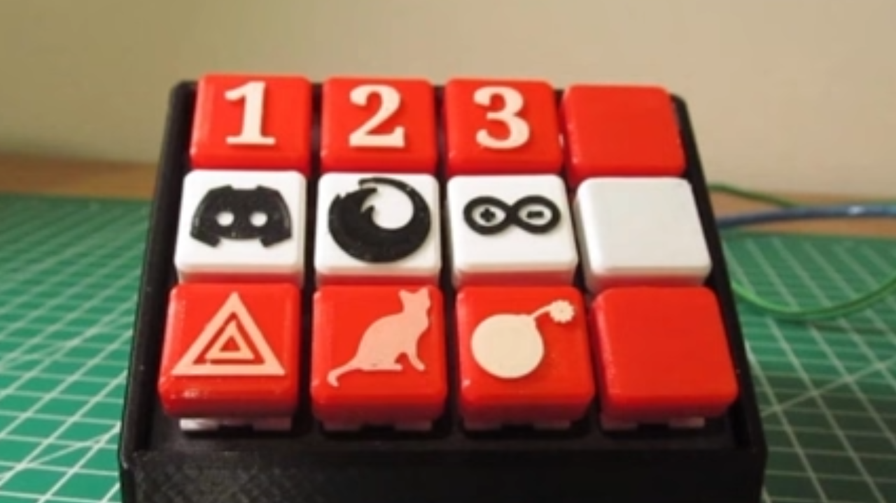

# Arduino ve 3D Baskı Buttonbox Projesi

Bu projede, Arduino ve 3D baskı kullanarak basit bir buttonbox (streamdeck) yapımını adım adım öğreneceksiniz. Buttonbox, bilgisayarınızda kısayol tuşlarına atadığınız işlevleri tek bir yerden kontrol etmenizi sağlar. Oyun oynama, video düzenleme gibi işlemleri daha kolay hale getirir. Bu rehberde, 3D yazıcı ile kendi kasanızı tasarlayıp, Arduino ile kodlama yaparak elektronik devrelerini kuracağız.

> İşte montajı tamamlanmış haliyle buttonbox:



## Video Linki
Videoyu izlemek için [Tıklayın](https://www.youtube.com/embed/vc0klLAnj_Q).

## Malzeme Listesi
- **Arduino Pro micro**
- **12 adet Mekanik Klavye Switchi**
- **100 Gram Filament**
- **Kablolar**

## 3D Modellerin İndirme Linkleri
- [Thingiverse Modeli](https://www.thingiverse.com/thing:4186055)

## Devre Şeması
GND hattını çekiyoruz.


ARDUİNO Bağlantılarını yapıyoruz.


## Arduino Kodu
```cpp
/*
 *  Proje      'Stream Cheap' Mini Macro Klavye
 *  @yazar     David Madison
 *  @bağlantı   partsnotincluded.com/electronics/diy-stream-deck-mini-macro-keyboard
 *  @lisans     MIT - Telif Hakkı (c) 2018 David Madison
 *
 * Bu yazılımın ve ilişkili belgelendirme dosyalarının (birlikte "Yazılım" olarak adlandırılır)
 * herhangi bir kişi tarafından edinilmesi durumunda, bu yazılımı sınırlama olmaksızın kullanma,
 * kopyalama, değiştirme, birleştirme, yayınlama, dağıtma, alt lisanslama ve/veya satma
 * hakkına sahiptir ve Yazılımın tüm kopyalarını veya önemli bir kısmını
 * şu koşullara tabi olarak yapabilir:
 *
 * Yukarıdaki telif hakkı bildirimi ve bu izin bildirimi, Yazılımın tüm kopyalarına veya
 * önemli bir kısmına dahil edilmelidir.
 *
 * YAZILIM "OLDUĞU GİBİ" TEMİN EDİLMEKTEDİR, HİÇBİR GARANTİ BEYANI VEYA KOŞULU, AÇIK
 * VEYA ZIMNİ, SATILABİLİRLİK, BELİRLİ BİR AMACA UYGUNLUK VEYA İHLAL ETMEYECEĞİ
 * DAHİL ANCAK BUNUNLA SINIRLI OLMAKSIZIN, HİÇBİR GARANTİ BEYANI VEYA KOŞULU
 * OLMADAN. HİÇBİR DURUMDA YAZARLAR VEYA TELİF HAKKI SAHİPLERİ, HERHANGİ BİR İDDİA,
 * HASAR VEYA DİĞER SORUMLULUK İÇİN, ANCAK ANLAŞMA, HAKSIZ FİİL VEYA DİĞER HUKUKİ
 * EYLEMLERDEN SORUMLU DEĞİLDİR, SORUMLU DEĞİLDİR, ANCAK BURADAKİ VEYA BU YAZILIMIN
 * KULLANIMI VEYA DİĞER İŞLEMLERDEN KAYNAKLANAN, BU YAZILIMIN KULLANIMI VEYA
 * DİĞER İŞLEMLERDEN KAYNAKLANAN HERHANGİ BİR HUSUS İÇİN.
 *
 * 12 düğme için Christian Dasbach tarafından değiştirildi
 *
 * Kod BERATRONİK Tarafından Türkçe Diline Çevrilmiştir.
 */
 
// ---------------------------------
// Tuş tanımlamaları (Sizi ilgilendiren kısım)
#define BUTTON_KEY1 KEY_F13
#define BUTTON_KEY2 KEY_F14
#define BUTTON_KEY3 KEY_F15
#define BUTTON_KEY4 KEY_F16
#define BUTTON_KEY5 KEY_F17
#define BUTTON_KEY6 KEY_F18
#define BUTTON_KEY7 KEY_F19
#define BUTTON_KEY8 KEY_F20
#define BUTTON_KEY9 KEY_F21
#define BUTTON_KEY10 KEY_F22
#define BUTTON_KEY11 KEY_F23
#define BUTTON_KEY12 KEY_F24
 
// Pin tanımlamaları
#define BUTTON_PIN1 2
#define BUTTON_PIN2 3
#define BUTTON_PIN3 4
#define BUTTON_PIN4 5
#define BUTTON_PIN5 6
#define BUTTON_PIN6 7
#define BUTTON_PIN7 8
#define BUTTON_PIN8 9
#define BUTTON_PIN9 10
#define BUTTON_PIN10 16
#define BUTTON_PIN11 14
#define BUTTON_PIN12 15
// ---------------------------------
 
#include "Keyboard.h"
 
// Basma/salma ve debounce işlemleri için düğme yardımcı sınıfı
class button {
  public:
  const char key;
  const uint8_t pin;
 
  button(uint8_t k, uint8_t p) : key(k), pin(p){}

  void press(boolean state){
    if(state == pressed || (millis() - lastPressed  <= debounceTime)){
      return; // Burada görmeye değer hiçbir şey yok
    }
 
    lastPressed = millis();
 
    state ? Keyboard.press(key) : Keyboard.release(key);    
    pressed = state;
  }
 
  void update(){
    press(!digitalRead(pin));
  }
 
  private:
  const long debounceTime = 30;
  unsigned long lastPressed;
  boolean pressed = 0;
} ;
 
// Dizi içinde düzenlenmiş düğme nesneleri
button buttons[] = {
  {BUTTON_KEY1, BUTTON_PIN1},
  {BUTTON_KEY2, BUTTON_PIN2},
  {BUTTON_KEY3, BUTTON_PIN3},
  {BUTTON_KEY4, BUTTON_PIN4},
  {BUTTON_KEY5, BUTTON_PIN5},
  {BUTTON_KEY6, BUTTON_PIN6},
  {BUTTON_KEY7, BUTTON_PIN7},
  {BUTTON_KEY8, BUTTON_PIN8},
  {BUTTON_KEY9, BUTTON_PIN9},
  {BUTTON_KEY10, BUTTON_PIN10},
  {BUTTON_KEY11, BUTTON_PIN11},
  {BUTTON_KEY12, BUTTON_PIN12},
};
 
const uint8_t NumButtons = sizeof(buttons) / sizeof(button);
const uint8_t ledPin = 17;
 
void setup() { 
  // Güvenlik kontrolü. Klavye girişlerini iptal etmek için pin #1'i (RX) toprağa bağlayın.
  pinMode(1, INPUT_PULLUP);
  if(!digitalRead(1)){
    failsafe();
  }
 
  // LED'leri Kapalı Konumda Ayarla. Aktif düşük.
  pinMode(ledPin, OUTPUT);
  digitalWrite(ledPin, HIGH);
  TXLED0;
 
  for(int i = 0; i < NumButtons; i++){
    pinMode(buttons[i].pin, INPUT_PULLUP);
  }
}
 
void loop() {
  for(int i = 0; i < NumButtons; i++){
    buttons[i].update();
  }
}
 
void failsafe(){
  for(;;){} // Bir süre burada takılalım :D
}
